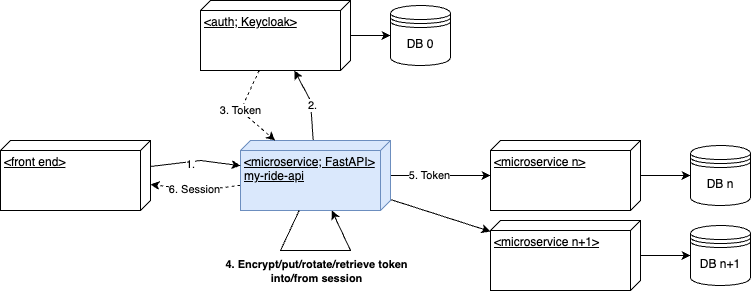

# my-ride-api
## About the project
A FastAPI-based microservice as a proxy to all the other microservices, which implements the following functionality: If the user's request does not contain a session, the system redirects the user to the Keycloak identity provider, retrieves a token, encrypts it, and stores it in the session. If the user's request does contain a session, the system retrieves the token, decrypts it, and uses it to access downstream services.

It implements [Backend For Frontend (BFF) Oauth2.0 application architecture](https://datatracker.ietf.org/doc/html/draft-ietf-oauth-browser-based-apps-24#name-application-architecture).

This solution was replaced by [Apache Apisix](https://apisix.apache.org/).


## Integration into my-ride ecosystem
The following UML deployment diagram shows all the components and the communication between them.




## Software design
Project follows clean architecture and SOLID principles. In short, high-level modules (business rules) do not depend on low-level ones (database, UI, API).
It consists of domain, application service and infrastructure layers.

Project follows testing pyramid framework from test driven development approach.


## Local testing of API
Command `docker compose build` builds Docker image and 
command `docker compose up api` starts the project.


# Development

## Running checks and tests

To run all checks and tests, execute:

```shell
docker compose run --rm --entrypoint ./entrypoint.sh api test local
```

## Update Python's packages

To run all checks and tests, execute:

```shell
docker compose run --rm --entrypoint ./entrypoint.sh api outdated
```


# Integration with PyCharm

## Configure the project interpreter

1. Go to **Settings / Project / Project Interpreter**
2. Click on the button on the bottom right to add a new one
3. Select **Docker compose** from the list of environments
4. Select the service **web** and press **OK**

## Configure FastAPI server

1. Add a new Run/Debug configuration in the menu **Run / Edit Configurations...**
using the template **FastAPI**
2. Set file with application as **Application file**
3. Set `app` as **Application name**
4. Set `--reload --host=0.0.0.0 --port=8000` as **Uvicorn options**
5. Select the Python interpreter created in **configure the project interpreter**

## Configure Pytest tests

1. Add a new Run/Debug configuration in the menu **Run / Edit Configurations...**
using the template **Python tests/pytest**
2. Specify `tests` folder as **Module name**
3. Specify `--numprocesses auto --no-cov` as **Additional Arguments** (optional)
4. Select the Python interpreter created in **configure the project interpreter**


# Deploying on Google Cloud Run instances

## Prerequisites

- Install the Google Cloud SDK as [described here](https://cloud.google.com/sdk/docs/downloads-interactive)
- Authenticate using your Google account with the command `gcloud auth login`
- Configure docker to use GCP credential helper `gcloud auth configure-docker europe-west4-docker.pkg.dev`


## Automatic deployment

Everytime some branch is merged and pushed to `develop` branch, Cloud Build (Trigger) will build and deploy `develop` 
branch on `my-ride-api-dev` Cloud Run instance.


## Manual deployment

To build and deploy some branch on some Cloud Run instance manually, execute the following command (trigger name is
the same as some Cloud Run instance).
```shell
gcloud builds triggers run <trigger name> --branch=<branch>
```
